# [Tryhackme](https://tryhackme.com/room/creative)

## Recon

establish **nmap scan** to discover open ports services that runs on them.
```bash
sudo nmap -T4 -sC -sV  creative.thm
```
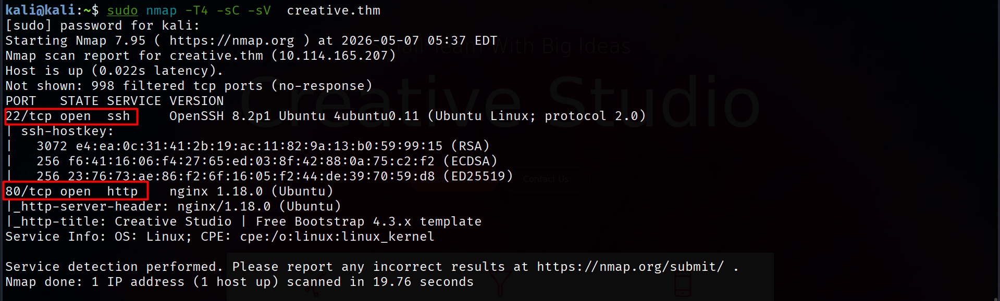

It reveals that there is only 2 open ports SSH and HTTP server listen on port `80/tcp`. Discovering this server's directories. 
```bash
ffuf -w /usr/share/wordlists/dirbuster/directory-list-2.3-medium.txt:FUZZ -u "http://creative.thm/" -fc 404
```
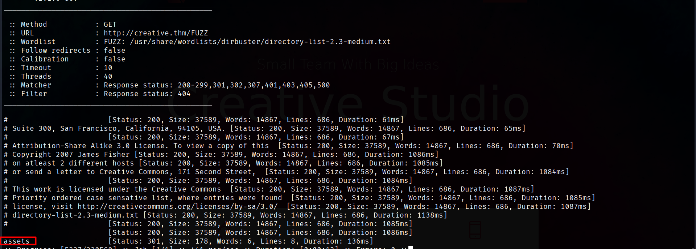

`/assets` is the only discovered page anyways this page have website page's content and also it is prohibited.

fuzzing Hosts to enumerate subdomains 
```bash
ffuf -w /usr/share/wordlists/amass/bitquark_subdomains_top100K.txt:FUZZ -u "http://creative.thm/" -H "Host:FUZZ.creative.thm" -fs 178
```

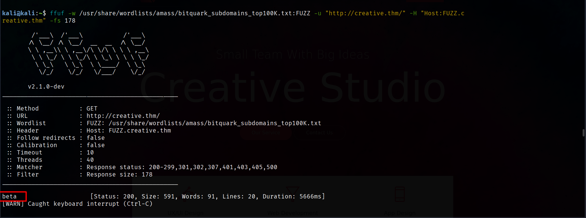

This subdomain function is to take URL then check if this URL alive. Sure this function done inside backend.

**Discover website functionality** 

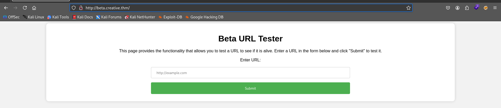

Trying invalid URL

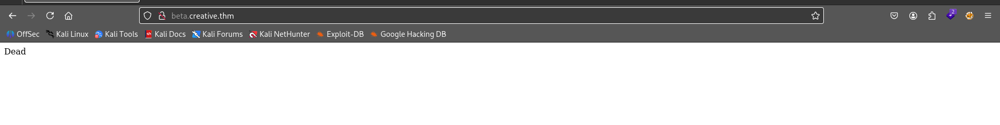

Trying valid URL 

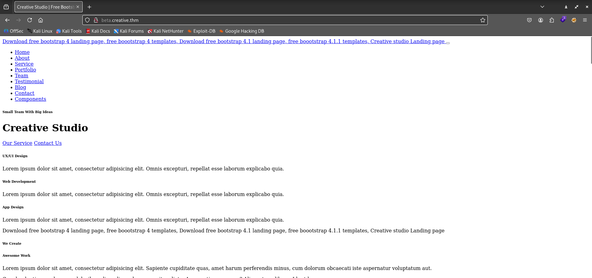

The application accepts a user URL and the server makes a request to that URL on behalf of the user. This behavior may lead to Server-Side Request Forgery (SSRF) if the request is not properly validated or restricted.

we can use [SSRFmap](https://github.com/swisskyrepo/ssrfmap) to fuzz server's local open ports. Firstly we must intercept POST request for any arbitrary URL.

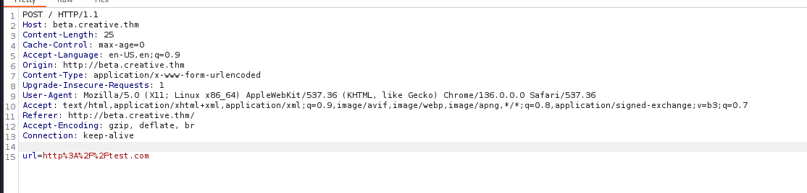

then save it to text file then use [SSRFmap](https://github.com/swisskyrepo/ssrfmap).

```bash
python3 ssrfmap.py -m portscan -r request.txt -p url
```

Fuzzing revel that port 1337 is open so we should request it from this webpage's function

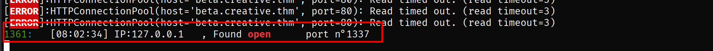

**Requesting localhost with port 1337**

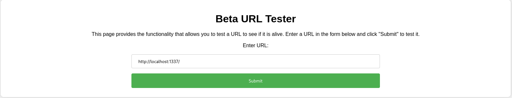

This port redirect us to server's FHS 

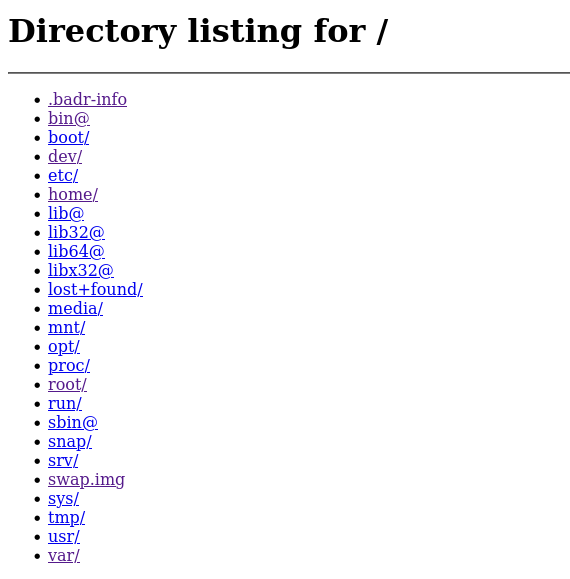

We can navigate to home directory and steal any user's SSH key to login into web server.

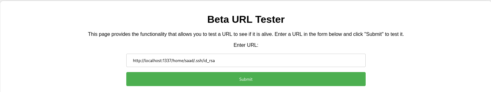

**Response**

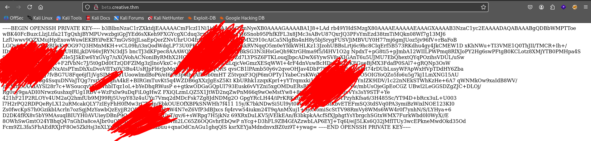

Copy this SSH key to txt file and change file permission

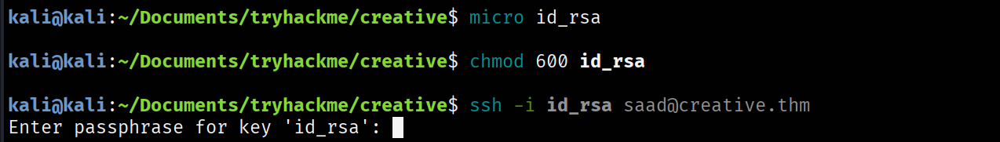

SSH key ask us for passphrase. In this situation we can crack it using John

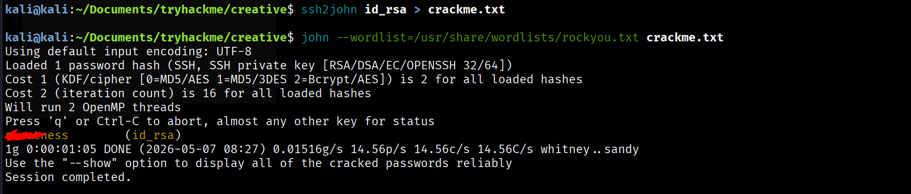

Now we have passphrase and SSH key
# Initial access

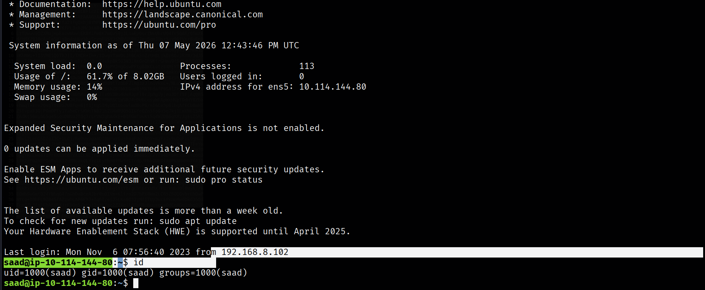

Now we have access to server. 

sweetness 

## Privilege escalation
### Enumeration
Using [LinPEAS](https://github.com/peass-ng/PEASS-ng/releases) tool to enumerate target machine.  

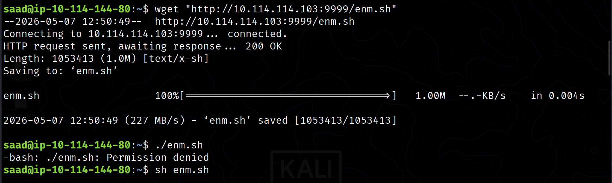

**Result**

This machine is vulnerable with [copy fail](https://copy.fail/) vulnerability we can abuse it with this [payload](https://github.com/slaptat/copyFail30/tree/main). Absolutely there is another exploits but this is fastest one.

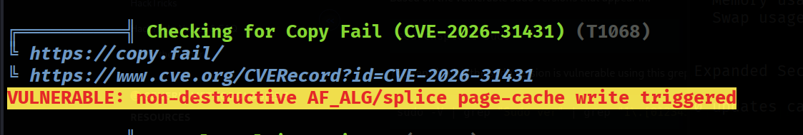

### Root Flag

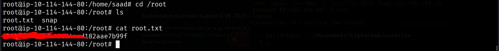
