# [Try Hack me : Daily Bugle Writeup](https://tryhackme.com/room/dailybugle)


## Enumeration

The initial step in our methodology is to conduct an Nmap scan to discover active services running on the target machine.

```bash
sudo nmap -T4 -sS -f -f 10.128.131.98 -oN file.txt
```

**Nmap Results:**

```
Nmap scan report for 10.128.131.98
Host is up (0.030s latency).
Not shown: 997 filtered tcp ports (no-response)
PORT     STATE SERVICE
22/tcp   open  ssh
80/tcp   open  http
3306/tcp open  mysql
```

The scan reveals three open ports: SSH (22), HTTP (80), and MySQL (3306). Our primary focus for initial investigation will be the HTTP service.

Visiting the web application displays a blog post regarding a "fake Spider-Man" robbing a bank, which provides the answer to the first challenge question. Based on the challenge description, we know this is a Content Management System (CMS). To gather more specific information, we utilize a [CMS enumeration tool](https://github.com/Tuhinshubhra/CMSeeK).

```bash
python3 cmsseek.py -u 'http://10.129.133.52'
```

**Result:**

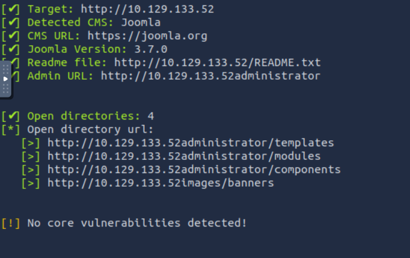

To uncover hidden administrative panels or directories, we can perform directory bruteforcing against the `/administrator/` path.

```bash
gobuster dir -u "http://10.129.133.52/administrator/" -w /usr/share/wordlists/dirbuster/directory-list-2.3-medium.txt
```

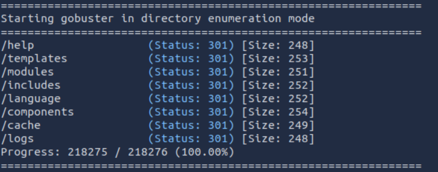

This directory enumeration reveals several interesting paths. By inspecting the contents of the discovered files, we successfully identify the exact Joomla version running on the server.

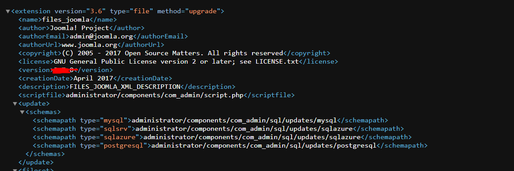
Searching for vulnerabilities associated with this specific Joomla version reveals it is susceptible to SQL Injection (SQLi) via [**CVE-2017-8917**](https://nvd.nist.gov/vuln/detail/CVE-2017-8917).

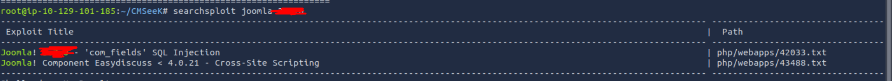

---

## Exploitation

There are two potential methods to exploit this SQLi vulnerability. The first approach involves manually executing the technique described in the CVE documentation. The second, more efficient method is to use a publicly available exploit script [(Joomblah.py)](https://github.com/teranpeterson/Joomblah) from GitHub. Executing this script successfully dumps the database users and their hashes.

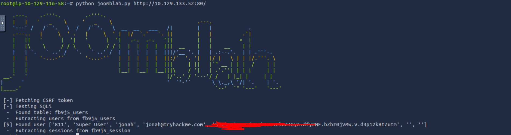

The next step is to crack the retrieved user hash to obtain a plaintext password. We can accomplish this using John the Ripper and the RockYou wordlist.

```
john --wordlist=/usr/share/wordlists/rockyou.txt --format=bcrypt crackme.txt
```

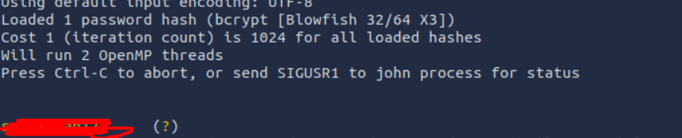

---

## Initial Access

With the successfully cracked password, we now possess valid credentials to log into the Joomla administrator backend.

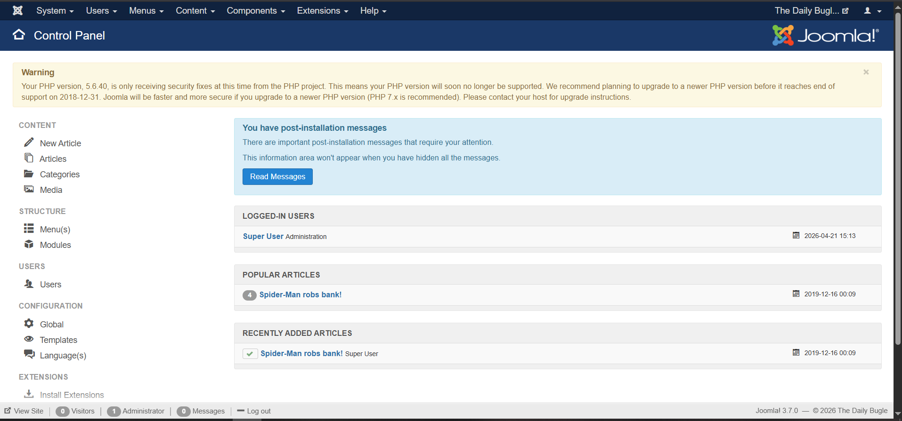

To achieve remote code execution on the underlying system from the Joomla backend, we can inject a reverse shell into a template file. The process is as follows:

1. Navigate to **Extensions** => **Templates** => **Protostar Details and Files**.
    
2. Click on **New file**.
    

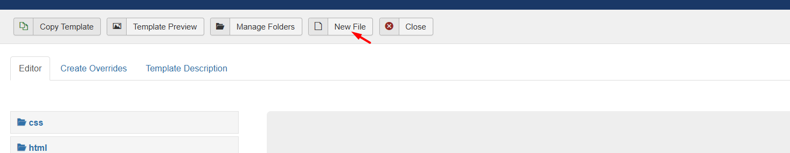

3. Inject the `pentestmonkey` PHP reverse shell code into the newly created file.
    
4. Save the file, start a Netcat listener on your attack machine, and execute the payload by navigating to the file's public URL.
    

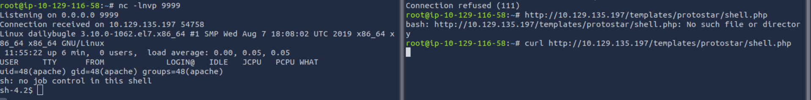

This successfully grants us an initial reverse shell on the target system.

---

## Privilege Escalation

### Enumeration & Lateral Movement

To identify privilege escalation vectors, we transfer and execute the `LinEnum.sh` script on the compromised machine. The enumeration uncovers a sensitive PHP configuration file for the webserver located in `/var/www/html`.

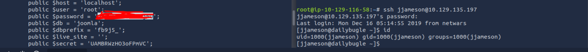

Reviewing this configuration file reveals a set of database credentials. We can reuse this discovered password to switch users and authenticate via SSH as the user `jjameson`.

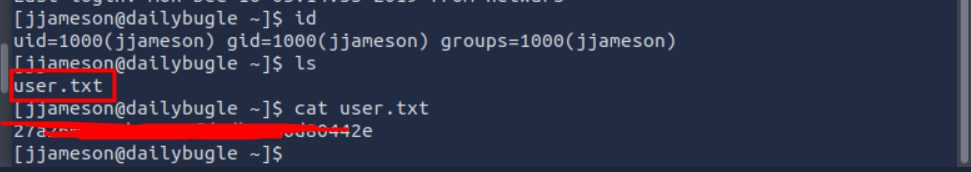

Within `jjameson`'s home directory, we can locate and read the user flag.

### Root Escalation

Running `sudo -l` reveals that the current user has `sudo` privileges to execute the `yum` package manager without a password. We can abuse this misconfiguration by crafting a malicious custom `yum` plugin to execute system commands as root.

We deploy the following payload to trigger the exploit:

Bash

```
printf "[main]\nplugins=1\npluginpath=/tmp\npluginconfpath=/tmp\n" > /tmp/x && printf "[main]\nenabled=1\n" > /tmp/y.conf && printf "import os\nos.system('/bin/sh')\n" > /tmp/y.py && sudo yum -c /tmp/x --enableplugin=y list
```

![[dai-12.png]]

Executing this payload successfully drops us into a root shell, allowing us to capture the final root flag.

![[day-13.png]]
