# [Tryhackme:Valley](https://tryhackme.com/room/valleype)
## Enumeration
Doing some *Nmaps* to discover open ports, 
```bash
sudo nmap -T4 -Pn <target>
```
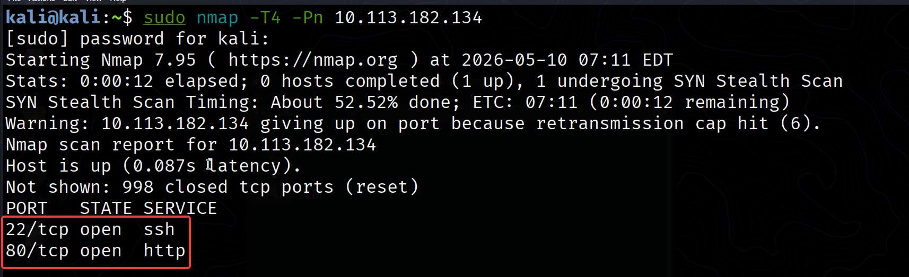

There is two open ports HTTP and SSH, I elicited that we will attack HTTP server => find valid credential => login to SSH server. Very common CTF sequence.
**Scanning versions of services**
```bash
 sudo nmap -T4 -Pn -p80,22 -sC -sV <target>
```
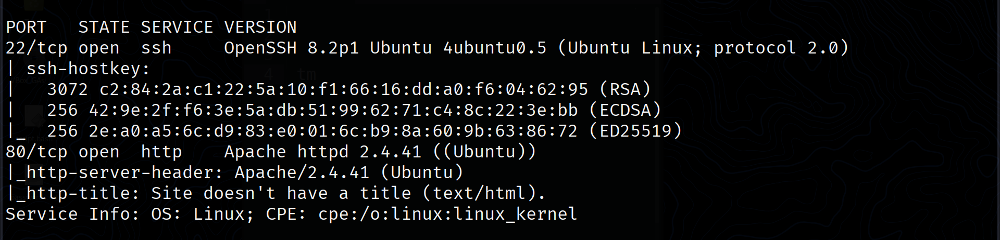

Both services are not vulnerable as expected. moving to next step which is discover HTTP server. I discover website functionality, it is a simple website that have no complexity. I did some **directory fuzzing** 

```bash
ffuf -w /usr/share/wordlists/dirbuster/directory-list-2.3-medium.txt:FUZZ -u "http://<target>/FUZZ" -fc 404 
```
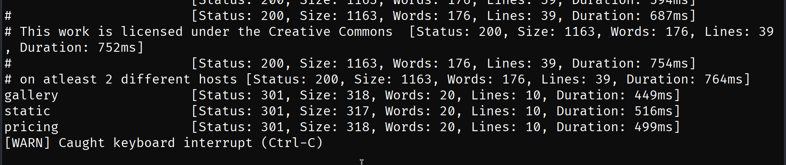

it lead us to those directories. after fuzzing them I found inside pricing directory this note.

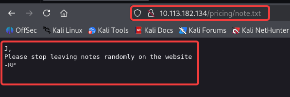

We can conclude that User **J** is leaving some random note and user **RP** is the developer or something like that. But It add to us more information that **RP** is someone who have good access inside this system.

**Containing discovering** I found static directory which have all photos in `/gallrey` directory 
```bash
ffuf -w /usr/share/wordlists/dirbuster/directory-list-2.3-medium.txt:FUZZ -u "http://<target>/static/FUZZ" -fc 404
```
Fuzzing content of this directory I found normal photos but suddenly I found suspicions file with 

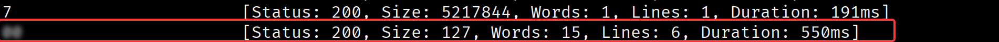

Discovering this file content...

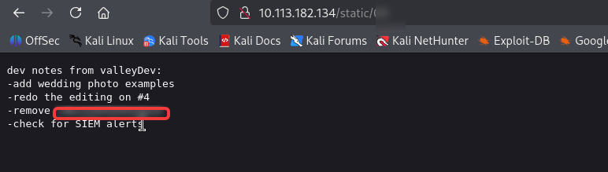

I found this note which content some tasks, and of those tasks is remove web directory. Discovering this directory it will redirect us to this login page:

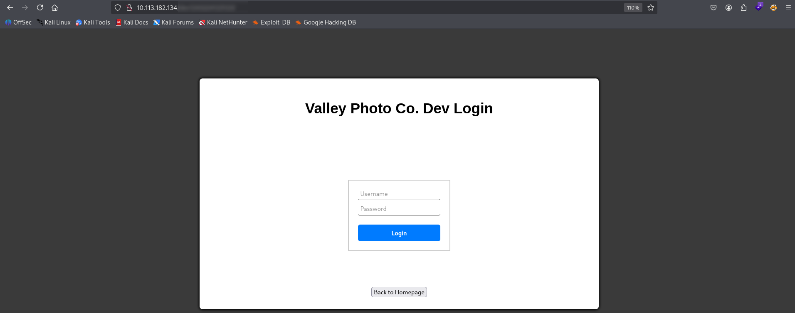

Viewing source code I figure out that 
in line `22` there is no `action` parameter for this form so I elicit that the authentication happen inside user-side and in line `9` there is JS code after discovering it , it disclose login credentials 

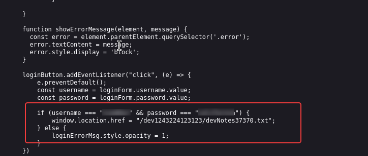

Using this credential to login. After logging in we found this check list, and this give us very valuable information first one is *FTP* is not opened on port 21 so I will redo our nmap scan but make it discover all ports from range 0 to maximum range of ports.

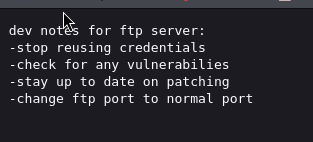

**Nmap scan**
```bash
sudo nmap -- min-parallelism 300 -p- -Pn <target>
```
and we got this unknown open port as note said.

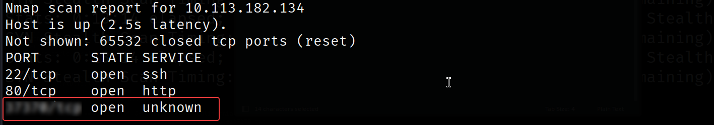

Logging into FTP with argument `-P` to specify port, also using credentials that we found before because note side `- stop reusing credentials` 

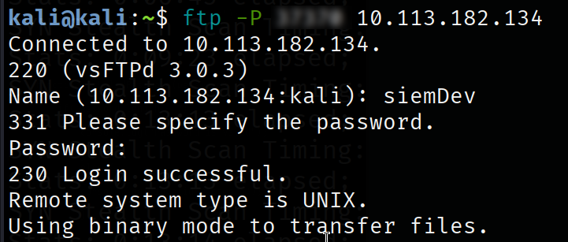

Listing files inside the directory we find 3 PCAP files, download those files

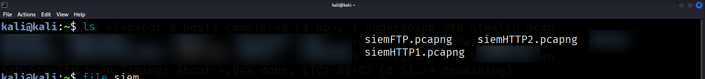

and analyze it... After analyzing it we found inside ***siemHTTP2.pcap*** file user valleyDev logging into localhost  service with this username and password

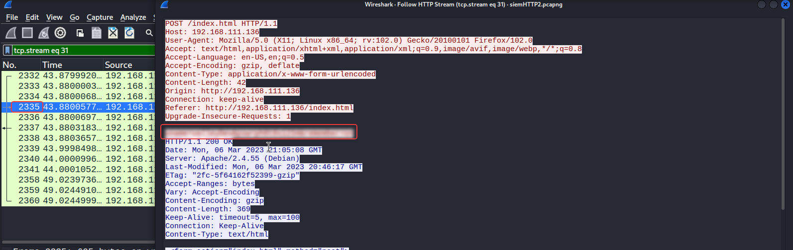

## Initial access

Logging to SSH using this username and password and we got a Bingo!

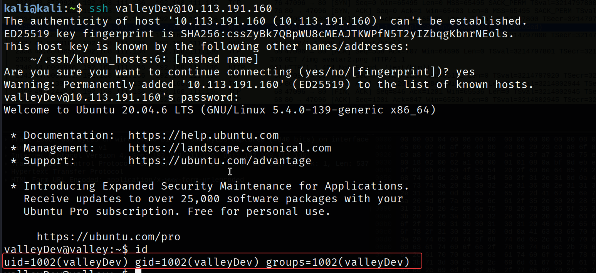

### User flag

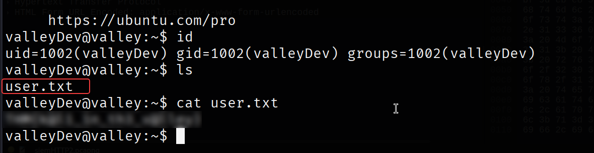

## Privilege escalation
For **enumeration** I will use [LinPEAS](https://github.com/peass-ng/PEASS-ng/releases/tag/20260510-cd4bd619) Script. First find writeable directory to install script which is `/tmp` .

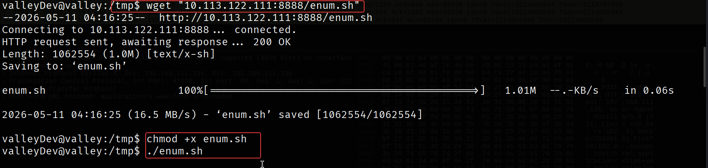

I found this executable inside home directory with valley user privileges this binary is authenticator which take user name and password for user then and if true it do some action.

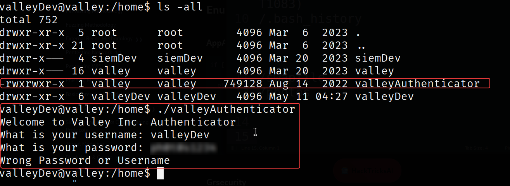

I will send this file to attacking machine to check it content with *strings* tool.

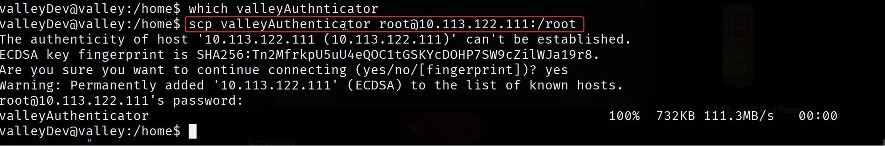

Using string command 

```bash
string -n 5 valleyAuthenticator
```

we should decompress this file with UPX decompressor 

```bash
upx -d valleyAuthenticator
```

using strings tool again after decompress the file

```bash
strings -n 5 valleyAuthenticator | grep -C 10 Welcome
```

[PoC photo deleted by fault]

we found the welcome message and to MD5 hashes we can crack it via [CrackStation](https://crackstation.net/) 

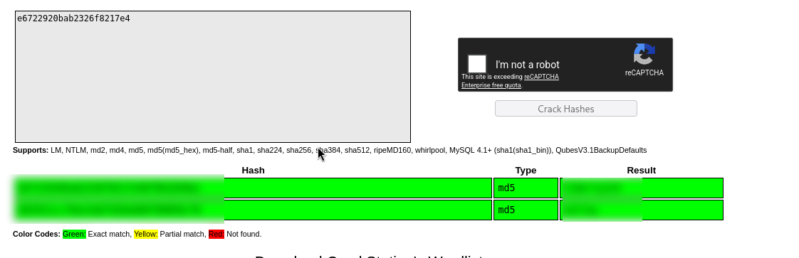

and we got  password for user *valley*. Using [LinPEAS](https://github.com/peass-ng/PEASS-ng/releases/tag/20260510-cd4bd619) again to enumeration. 

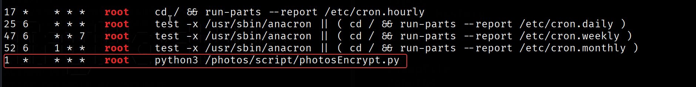

and we found this CRON job let's investigate it 

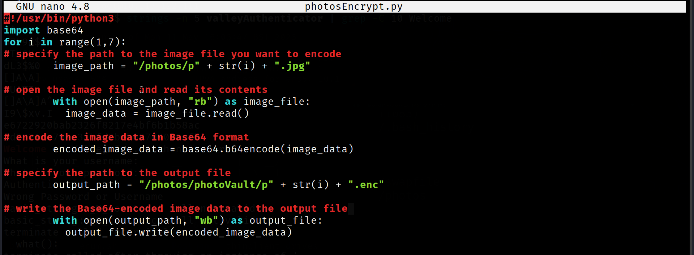

this script use base64 library so we can modify it. fortunately our user have permission to modify this file.

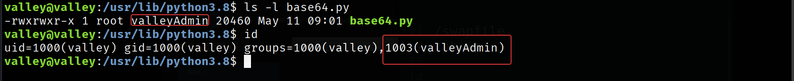

so I will modify it and force script to establish root shell.

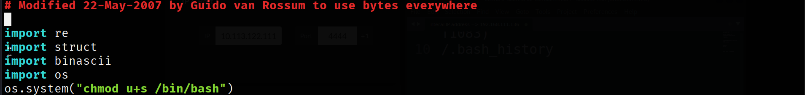

while crontab execute this script with python so we will add inside base64 malicious code to change permission of `/bin/bash` to run with root privilege not user privilege. 

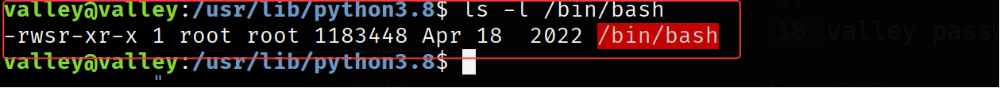

As we can see it works! now we need to execute /bin/bash and we will have root shell.

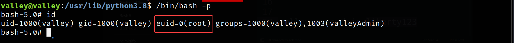

### root flag

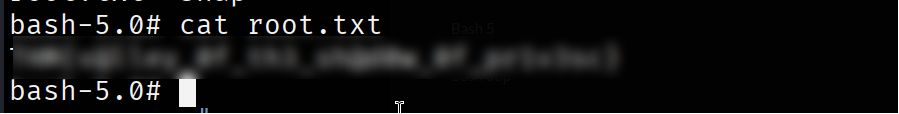
